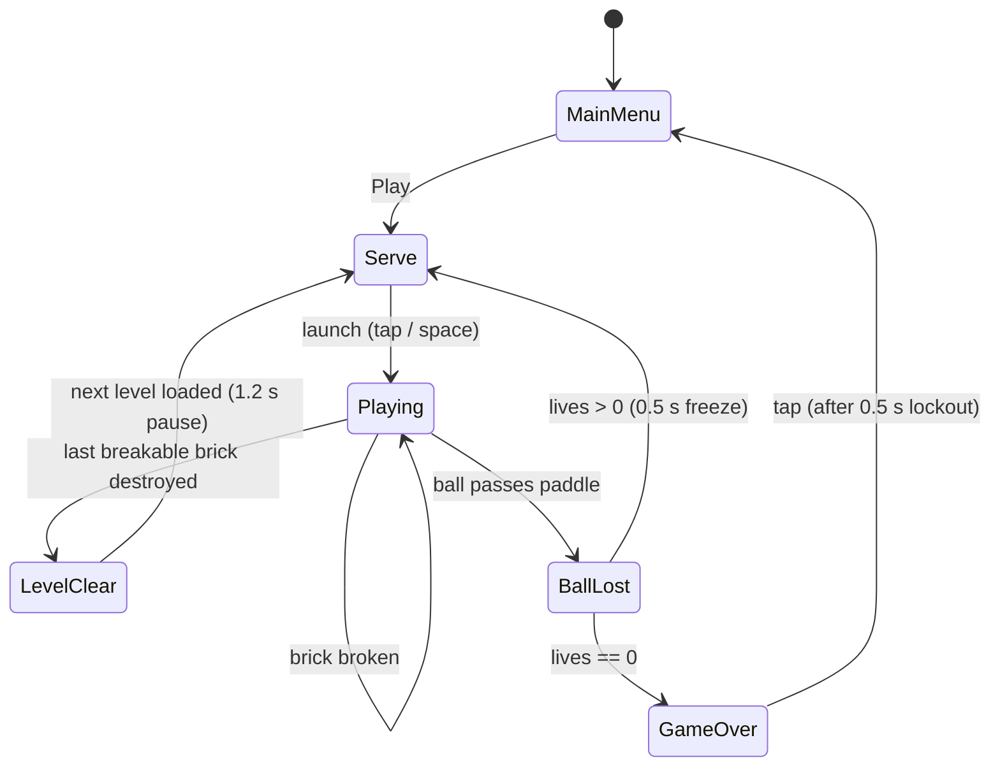
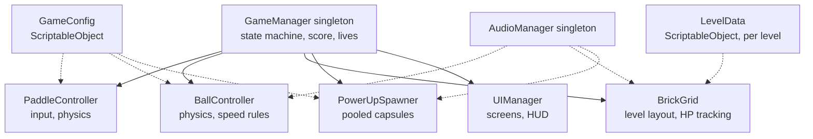

# Game Design Document — *SHATTERLINE*

| | |
|---|---|
| **Working title** | SHATTERLINE |
| **Team** | Roy Kalfon |
| **Genre** | Arcade / paddle-and-ball brick breaker (Breakout-style) |
| **Target platform** | PC (Windows standalone) + Android (mobile build) |
| **Engine / Unity version** | Unity 6 (6000.x LTS), URP, 2D |
| **Orientation & reference resolution** | Portrait, 720 × 1280 reference |
| **Expected session length** | 1–8 minutes per run (3 lives), designed for "one more try" replays |
| **Document version** | v0.1 — 2026-09-03 |

---

## 1. High Concept

The player drags a paddle left and right along the bottom of the screen to keep a ball in play. The ball bounces at a constant speed, breaking bricks in a fixed grid above on contact. Clear every brick to advance a level; miss the ball three times and it's game over. Occasional power-ups drop from broken bricks.

### Design pillars

1. **Deterministic, readable bounce** — the ball's speed is fixed per "speed tier"; only its *direction* changes on collision. Walls and bricks reflect the ball normally, and the paddle deflects it using a fixed formula based on where it lands (paddle centre → near-vertical, paddle edge → sharp angle, clamped to `paddleMaxDeflectionDeg`). No randomness is ever added to a bounce. This rules out "juicy" randomized ricochets — every miss must be traceable to where the player placed the paddle, never to noise.
2. **Escalating tension, capped unfairness** — ball speed increases in small fixed steps on paddle hits, up to a hard maximum. This rules out reflex-check spikes: no sudden speed bursts, no bricks that shoot back, no per-level speed jump. The game gets harder to read as it speeds up, never harder to react to fairly.
3. **Instant restart, nothing lingers** — losing all three lives cuts to a Game Over screen the player can dismiss into a fresh run in under two seconds. This rules out meta-progression, unlockables, or any currency that would make a loss feel like a resource loss rather than a clean skill check.

---

## 2. Reference & Inspiration

<!-- Screenshot placeholder: a build screenshot goes here once one exists. The arcade games below are commercial products, so their screenshots aren't freely licensed to embed in this document. -->

- **Primary reference:** Atari's *Breakout* (1976) and Taito's *Arkanoid* (1986). Taking: the core paddle/ball/brick loop, angle-based paddle deflection, and Arkanoid's falling capsule power-ups. Not taking: Arkanoid's enemies (Moleks), boss fights, or the "Vaus ship" transformation gimmick — this project stays a pure brick-breaker.
- **Video:** [Arkanoid (Arcade) — complete gameplay, no deaths](https://www.youtube.com/watch?v=Ek3Z6zlIJNw) — the first 5 minutes are the reference for paddle feel and capsule behaviour.
- **Background:** [Breakout (video game) — Wikipedia](https://en.wikipedia.org/wiki/Breakout_(video_game)), [Arkanoid — Wikipedia](https://en.wikipedia.org/wiki/Arkanoid)

---

## 3. Core Game Loop

**Moment-to-moment rules:**

- The ball travels at a constant speed per tier; only its direction vector changes on collision. Walls and bricks reflect it normally; the paddle reflects it using the fixed offset-from-centre formula in Pillar 1, so a hit near the edge always sends the ball off at a sharper angle than a hit near the centre.
- A paddle hit is the *only* source of the ball's small speed increase (`+speedStepPerHit`, capped at `maxBallSpeed`) — bricks change the ball's direction and the player's score, never its speed.
- Bricks come in two flavours: standard bricks break in 1 hit (worth `10 × row index` points), and tough bricks (top two rows) take 2 hits and visibly flash on the first hit.
- **Scoring:** score increments the instant a brick's HP reaches zero, by that brick's fixed point value — never on hit, only on destroy.
- **Power-ups:** every destroyed brick has a flat 12% chance to drop one pooled falling capsule (Widen Paddle, Slow Ball, or Multi-Ball). Catching it with the paddle applies the effect immediately; Widen Paddle and Slow Ball start a coroutine-driven duration timer that reverts the effect, while Multi-Ball immediately spawns two extra pooled balls.
- **Failure:** the ball is lost the instant its position passes below the paddle's Y position while moving downward. Lives −1, then a 0.5 s freeze plays before the next serve so the loss reads clearly before play resumes.
- Level clear triggers the instant the last breakable brick is destroyed (standard or tough — any indestructible border decoration, if used, never counts).

### Tuning parameters

| Parameter | What it controls | First guess |
|---|---|---|
| `paddleSpeed` | How fast the paddle tracks keyboard/touch input | 12 u/s |
| `ballBaseSpeed` | Ball speed at the start of every serve | 7 u/s |
| `speedStepPerHit` | Speed added to the ball on each paddle hit | 0.15 u/s |
| `maxBallSpeed` | Hard cap on ball speed regardless of hits | 12 u/s |
| `paddleMaxDeflectionDeg` | Steepest angle a paddle-edge hit can send the ball | 60° |
| `powerUpDropChance` | Odds a destroyed brick spawns a falling capsule | 0.12 |
| `livesStart` | Lives the player starts each run with | 3 |

**Where these live:** a single `GameConfig` ScriptableObject asset referenced by `PaddleController`, `BallController`, and `PowerUpSpawner`, so every number above is tunable in the Inspector without touching code or recompiling.

**Feel target:** a first-time player should clear at least one full level within 3 attempts; a player who's practiced for 10 minutes should be able to 3-life a full level cleanly.

---

## 4. Controls & Input

| Action | Keyboard / Mouse | Gamepad | Touch |
|---|---|---|---|
| Move paddle | ←/→ or A/D, or mouse X position | Left stick / D-pad X | Drag anywhere on screen (paddle follows finger X) |
| Launch ball | Space / Left click | South button (A / Cross) | Tap anywhere |
| Pause | Esc | Start button | Tap pause icon (top corner) |
| Confirm (menus) | Space / Enter / Left click | South button | Tap |

- Input is polled every frame via the Input System's action API in `Update`, but paddle movement is applied in `FixedUpdate` against the paddle's `Rigidbody2D`, so paddle motion stays in lock-step with the ball's physics step instead of racing a frame ahead of it.
- A tap/click on a UI element (pause icon, menu button) is consumed by the UI event system for that frame and does not also register as a "launch ball" or paddle-drag input.
- On the Game Over screen, input is locked out for 0.5 s after the screen appears, specifically so the tap that lost the last life can't also register as "restart" — a common cheap-restart bug in this genre.

---

## 5. Screens & UI

<!-- Layout sketch / in-editor screenshot placeholder: goes here once the HUD exists. -->

1. **Main Menu** — Title ("SHATTERLINE"), "PLAY" button, "Best Score: N" label, small mute toggle icon (top corner).
2. **Playing (HUD)** — Score (top-left), lives shown as 3 small paddle icons (top-right), current level number (top-centre, small). Nothing else: no combo counters, no timers, no minimap — the pillars call for a clean, uncluttered read of the playfield.
3. **Pause overlay** — semi-transparent dim over the playfield, "PAUSED" label, "RESUME" and "QUIT TO MENU" buttons.
4. **Level Clear overlay** — "LEVEL N CLEAR" banner, auto-advances to the next level's Serve state after 1.2 s (no button needed).
5. **Game Over overlay** — "GAME OVER", final score, best score (with a "NEW BEST!" tag if beaten this run), "RETRY" and "MENU" buttons.

- **HUD during play:** score, lives, level number only. An active power-up is communicated purely through the paddle's own visual state (wider, or glowing for Slow Ball) rather than a HUD icon or countdown, keeping the top bar uncluttered per Pillar 1's "readable" goal.
- **Canvas setup:** Screen Space – Overlay canvas, `CanvasScaler` in *Scale With Screen Size* mode, reference resolution 720 × 1280, Match = 0.5 so the portrait playfield scales sensibly across different phone aspect ratios.

---

## 6. Art & Audio

| Asset | Variants / frames | Source & licence | Use |
|---|---|---|---|
| Paddle sprite | 1 (tinted per power-up state) | [Kenney — Puzzle Pack 1](https://kenney.nl/assets/puzzle-pack-1), CC0 | Player paddle |
| Ball sprite | 1 | Kenney — Puzzle Pack 1, CC0 | Ball |
| Brick sprites | 4 colours (row-tinted) | Kenney — Puzzle Pack 1, CC0 | Breakable bricks |
| Power-up capsule sprites | 3 (Widen / Slow / Multi) | Kenney — Puzzle Pack 1 + Kenney UI Pack, CC0 | Falling power-up pickups |
| Brick-break particle | 1 (tinted per brick colour) | Built with Unity's built-in Particle System — no external asset | Pooled destroy VFX |
| Bounce / break / power-up / game-over SFX | 4 short clips | [Kenney — Impact Sounds](https://kenney.nl/assets/impact-sounds) + [Kenney — UI Audio](https://kenney.nl/assets/ui-audio), CC0 | Gameplay & UI feedback |
| UI font | 1 | Kenney Fonts pack, CC0 | All menu/HUD text |

**Licence note:** every asset above is Kenney.nl work released under CC0 1.0 — public domain, free to use, modify, and redistribute (commercially or not) without attribution. Nothing here needs to be swapped out for a public release; crediting Kenney on a course credits screen is a nice-to-have, not a requirement.

**Technical art rules:** sprites imported as `Point (no filter)`, Pixels Per Unit = 100 to match a 1-world-unit-per-tile grid, all gameplay sprites packed into a single `SpriteAtlas` to keep draw calls low on mobile. Sorting layers back→front: `Background` → `Bricks` → `PowerUps` → `Ball` → `Paddle` → `VFX` → `UI`.

---

## 7. Technical Design

**Scenes:** one gameplay scene, `Game.unity`. Main Menu, HUD, Pause, Level Clear, and Game Over are UI Canvases toggled by `UIManager`, not separate scenes. Restart reloads the scene via `SceneManager.LoadScene` — the simplest way to guarantee pooled objects and singleton state reset cleanly between runs.

**Packages / systems used:** Input System (new), Physics2D (`Rigidbody2D` + `Collider2D` on ball/paddle/bricks, `Collision2D` events drive hit reactions), URP 2D Renderer, TextMeshPro for all UI text.

**Target device:** a mid-range Android phone (test target: a Pixel 6a or equivalent, Android 12+) for the mobile build; Windows desktop standalone as the primary dev/demo target.

**Architecture:**

| Script | Responsibility |
|---|---|
| `GameManager` | Owns the game state machine (Menu/Serve/Playing/LevelClear/GameOver), score, and lives |
| `PaddleController` | Reads input, moves the paddle `Rigidbody2D`, applies active power-up modifiers (width, speed) |
| `BallController` | Applies constant-speed movement, handles wall/brick/paddle reflection math, tracks per-ball speed tier |
| `BrickGrid` | Instantiates a level's bricks from `LevelData`, tracks remaining breakable-brick count, reports level clear |
| `Brick` | Tracks its own HP, plays hit/break feedback, tells `BrickGrid` and `GameManager` when it breaks |
| `PowerUpSpawner` | Owns the object pool for falling capsules, rolls drop chance, applies effects on paddle catch |
| `ObjectPool<T>` | Generic pool used by `PowerUpSpawner` and the brick-break particle system; get/return only, no runtime Instantiate/Destroy during play |
| `UIManager` | Shows/hides the Menu, HUD, Pause, LevelClear, and GameOver canvases in response to `GameManager` state changes |
| `AudioManager` | Singleton; plays one-shot SFX and looping menu/gameplay music, exposes a mute toggle |
| `GameConfig` | ScriptableObject holding every tunable number from §3 |
| `LevelData` | ScriptableObject holding one level's brick grid layout (row × column HP values) |

### The course features this project demonstrates

1. **Object pooling** — falling power-up capsules and brick-break particle bursts are both pooled (a 6-capsule pool, a 12-particle-system pool). A single playthrough can break 50+ bricks in well under a minute; Instantiate/Destroy at that rate causes visible GC-spike stutter, and a dropped frame in a game whose entire challenge is precise paddle timing reads as an unfair death — exactly the kind of unfairness Pillar 2 rules out.
2. **Coroutines** — the "3, 2, 1" serve countdown, the 0.5 s freeze after a lost ball, the 1.2 s auto-advance on level clear, and every power-up's duration timer (Widen Paddle and Slow Ball each run on an `IEnumerator` timer that reverts the effect and safely restarts itself if the same power-up is caught again) all live as coroutines on `GameManager` / `PaddleController` — one readable sequence per behaviour instead of hand-rolled `Update` timers.
3. **Singletons** — `GameManager` and `AudioManager` are the project's only two singletons (a simple static-instance pattern, `DontDestroyOnLoad` only where scene-persistence is actually needed). Every other script talks to them instead of holding direct scene references, keeping `Brick`, `PowerUpSpawner`, and `UIManager` decoupled from each other.
4. **Mobile build** — the input layer is written against the Input System's action-based API from day one (touch drag maps to the same "Move" action as keyboard/mouse), the Canvas uses *Scale With Screen Size*, and the project is actually built and hand-tested as an Android APK on the device named above — not assumed to work "because Unity is cross-platform."
5. **ScriptableObject-driven config & levels** — `GameConfig` centralizes every number from the tuning table so none of it is a magic number buried in a script, and `LevelData` turns each level's brick layout into an asset rather than a hardcoded instantiation call, so adding a 6th level is "create one more asset," not "write more code."

---

## 8. Scope

### 8.1 MVP — the game is not a game without these

- [ ] Paddle moves via keyboard/mouse and touch drag, clamped to screen bounds
- [ ] Ball launches on input, moves at constant speed, reflects correctly off walls, paddle, and bricks
- [ ] One hand-built brick layout (`LevelData` asset) with standard (1-hit) and tough (2-hit) bricks
- [ ] Score increments correctly on brick destroy; HUD shows score, lives, level number
- [ ] Ball-lost detection, 3-life system, Game Over screen with restart
- [ ] Level-clear detection when all breakable bricks are gone
- [ ] Main Menu → Play → Game Over → Menu loop fully wired
- [ ] Bounce / break / game-over SFX
- [ ] Builds and runs correctly on both Windows standalone and an Android device

### 8.2 Polish — if the MVP is done and playable

- [ ] All 3 power-ups (Widen Paddle, Slow Ball, Multi-Ball) implemented via the pooled `PowerUpSpawner`
- [ ] Pooled brick-break particle burst
- [ ] 4–5 hand-built level layouts loaded in sequence, looping back to level 1 with a small speed-tier bump
- [ ] Screen shake on tough-brick break (coroutine-driven)
- [ ] Best score persisted via `PlayerPrefs` and shown on Main Menu / Game Over
- [ ] Mute toggle for audio
- [ ] Simple paddle-hit / brick-hit flash juice

### 8.3 Explicitly out of scope — we are **not** building these

- Any online service — leaderboards, cloud saves, multiplayer (local or networked)
- A level editor or in-game level authoring UI — levels are hand-authored `LevelData` assets only
- Enemies, boss fights, or any Arkanoid-style "Vaus ship" transformation — this stays a pure brick-breaker
- Any save data beyond a single `PlayerPrefs` best-score integer — no profiles, no cloud sync, no achievements
- Procedural or infinite level generation — the level set is a fixed, hand-placed list
- Controller rumble/haptics, colour-blind modes, or accessibility settings beyond a mute toggle (a known, documented gap — not a forgotten one)

---

## Changelog

| Version | Date | Change |
|---|---|---|
| v0.1 | 2026-09-03 | Initial draft |
