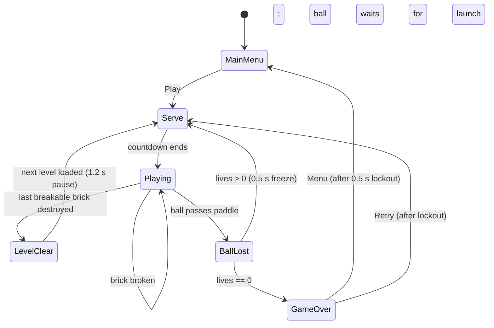
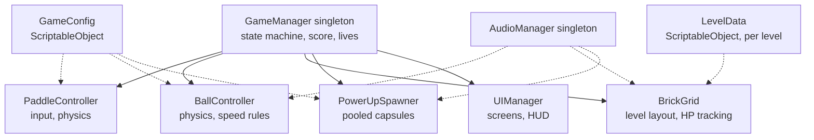

# Game Design Document — *SHATTERLINE*

| | |
|---|---|
| **Working title** | SHATTERLINE |
| **Team** | Roy Kalfon |
| **Genre** | Arcade / paddle-and-ball brick breaker (Breakout-style) |
| **Target platform** | PC (Windows standalone) + Android (mobile build) |
| **Engine / Unity version** | Unity 6 (6000.3.20f1 LTS), URP, 2D |
| **Orientation & reference resolution** | Portrait, 720 × 1280 reference |
| **Expected session length** | 1–8 minutes per run (3 lives), designed for "one more try" replays |
| **Document version** | v0.4 — 2026-10-01 |

---

## 1. High Concept

The player drags a paddle left and right along the bottom of the screen to keep a ball in play. The ball bounces at a constant speed, breaking bricks in a fixed grid above on contact. Clear every brick to advance a level; miss the ball three times and it's game over. Occasional power-ups drop from broken bricks.

### Design pillars

1. **Deterministic, readable bounce** — the ball's speed is fixed per "speed tier"; only its *direction* changes on collision. Walls and bricks reflect the ball normally, and the paddle deflects it using a fixed formula based on where it lands (paddle centre → near-vertical, paddle edge → sharp angle, clamped to `paddleMaxDeflectionDeg`). No randomness is ever added to a bounce. This rules out "juicy" randomized ricochets — every miss must be traceable to where the player placed the paddle, never to noise.
2. **Escalating tension, capped unfairness** — ball speed increases in small fixed steps on paddle hits, up to a hard maximum. This rules out reflex-check spikes: no sudden speed bursts, no bricks that shoot back, no per-level speed jump. The game gets harder to read as it speeds up, never harder to react to fairly.
3. **Instant restart, nothing lingers** — losing all three lives cuts to a Game Over screen the player can dismiss into a fresh run in under two seconds. This rules out meta-progression, unlockables, or any currency that would make a loss feel like a resource loss rather than a clean skill check.

---

## 2. Reference & Inspiration

Current project screenshots will be captured under `Docs/Screenshots/`.

- **Primary reference:** Atari's *Breakout* (1976) and Taito's *Arkanoid* (1986). Taking: the core paddle/ball/brick loop, angle-based paddle deflection, and Arkanoid's falling capsule power-ups. Not taking: Arkanoid's enemies (Moleks), boss fights, or the "Vaus ship" transformation gimmick — this project stays a pure brick-breaker.
- **Video:** [Arkanoid (Arcade) — complete gameplay, no deaths](https://www.youtube.com/watch?v=Ek3Z6zlIJNw) — the first 5 minutes are the reference for paddle feel and capsule behaviour.
- **Background:** [Breakout (video game) — Wikipedia](https://en.wikipedia.org/wiki/Breakout_(video_game)), [Arkanoid — Wikipedia](https://en.wikipedia.org/wiki/Arkanoid)

---

## 3. Core Game Loop

```mermaid
stateDiagram-v2
    [*] --> MainMenu
    MainMenu --> Serve: Play
    Serve --> Playing: countdown ends; ball waits for launch
    Playing --> Playing: brick broken
    Playing --> LevelClear: last breakable brick destroyed
    Playing --> BallLost: ball passes paddle
    BallLost --> Serve: lives > 0 (0.5 s freeze)
    BallLost --> GameOver: lives == 0
    LevelClear --> Serve: next level loaded (1.2 s pause)
    GameOver --> MainMenu: Menu (after 0.5 s lockout)
    GameOver --> Serve: Retry (after lockout)
```

**Moment-to-moment rules:**

- The ball travels at a constant speed per tier; only its direction vector changes on collision. Walls and bricks reflect it normally; the paddle reflects it using the fixed offset-from-centre formula in Pillar 1, so a hit near the edge always sends the ball off at a sharper angle than a hit near the centre.
- A paddle hit is the *only* source of the ball's small speed increase (`+speedStepPerHit`, capped at `maxBallSpeed`) — bricks change the ball's direction and the player's score, never its speed.
- Bricks come in two flavours: standard bricks break in 1 hit (worth `10 × row index` points), and tough bricks take 2 hits. Tough-brick placement is authored per layout; the first hit flashes and leaves a persistent visible crack. Only destruction awards points.
- **Scoring:** score increments the instant a brick's HP reaches zero, by that brick's fixed point value — never on hit, only on destroy. Row index counts from the bottom of the grid upward, so the tougher top rows are worth the most points.
- **Power-ups:** every destroyed brick has a flat 12% chance to drop one pooled falling capsule (Widen Paddle, Slow Ball, or Multi-Ball). Catching it with the paddle applies the effect immediately; Widen Paddle and Slow Ball start a coroutine-driven duration timer that reverts the effect, while Multi-Ball immediately spawns two extra pooled balls.
- **Failure:** the ball is lost the instant its position passes below the paddle's Y position while moving downward. Lives −1, then a 0.5 s freeze plays before the next serve so the loss reads clearly before play resumes.
- Level clear triggers the instant the last breakable brick is destroyed (standard or tough — any indestructible border decoration, if used, never counts).

### Tuning parameters

| Parameter | What it controls | First guess |
|---|---|---|
| `paddleSpeed` | How fast the paddle tracks keyboard/gamepad input (mouse and touch are distance-based, unaffected) | 12 u/s |
| `ballBaseSpeed` | Ball speed at the start of every serve | 7 u/s |
| `speedStepPerHit` | Speed added to the ball on each paddle hit | 0.15 u/s |
| `maxBallSpeed` | Hard cap on ball speed regardless of hits | 12 u/s |
| `paddleMaxDeflectionDeg` | Steepest angle a paddle-edge hit can send the ball | 60° |
| `powerUpDropChance` | Odds a destroyed brick spawns a falling capsule | 0.12 |
| `livesStart` | Lives the player starts each run with | 3 |

**Where these live:** a single `GameConfig` ScriptableObject asset referenced by `PaddleController`, `BallController`, and `PowerUpSpawner`, so every number above is tunable in the Inspector without touching code or recompiling.

**Feel target:** a first-time player should clear at least one full level within 3 attempts; a player who's practiced for 10 minutes should be able to 3-life a full level cleanly.

---

## 4. Controls & Input

| Action | Keyboard / Mouse | Gamepad | Touch |
|---|---|---|---|
| Move paddle | ←/→ or A/D (rate-based), or mouse cursor X (absolute — paddle tracks the cursor's world position directly, every frame, clamped to the playfield) | Left stick / D-pad X (rate-based) | Drag anywhere on screen — paddle follows the *relative* delta of the drag, not an absolute finger position |
| Launch ball | Space / Left click | South button (A / Cross) | Tap anywhere |
| Pause | Esc | Start button | Tap pause icon (bottom-left) |
| Confirm (menus) | Space / Enter / Left click | South button | Tap |

- Mouse and touch are deliberately different: mouse is absolute cursor-tracking (the paddle *is* wherever the cursor is, clamped to bounds), because a mouse cursor can't "cover the ball" or teleport unexpectedly the way a first finger-down would. Touch uses a relative drag delta specifically to avoid that first-touch teleport/cover problem. Keyboard and gamepad are rate-based (`paddleSpeed`-driven), unaffected by either.
- Keyboard/gamepad and mouse use Input System actions. Touch drag samples the Input System primary pointer's position, converting its screen displacement to world distance once. Touch distance is never multiplied by frame time. Pointer movement is accumulated until `FixedUpdate` applies it through the paddle's `Rigidbody2D`, preventing fast render frames from dropping movement before a physics tick.
- `PointerInput` raycasts against interactive UI using the current pointer position. Gestures beginning over UI do not drag the paddle. Resume explicitly consumes the release frame, including the case where its overlay disappeared before gameplay polled the tap. Touch UI uses per-finger position/press bindings; launch uses the tap action.
- On the Game Over screen, input is locked out for 0.5 s after the screen appears, specifically so the tap that lost the last life can't also register as "restart" — a common cheap-restart bug in this genre.

---

## 5. Screens & UI

Screenshots: `Docs/Screenshots/menu.png` and `Docs/Screenshots/gameplay.png` once captured.

1. **Main Menu** — Title ("SHATTERLINE"), "PLAY" button, "Best Score: N" label, "QUIT" button below the score on desktop builds, sound-state toggle (top corner). QUIT saves preferences and exits immediately without confirmation; in the Unity Editor it stops Play mode. It is hidden on Android and other non-desktop players.
2. **Playing (HUD)** — Score (top-left), lives shown as 3 small paddle icons (top-right), current level number (top-centre, small). Nothing else: no combo counters, no timers, no minimap — the pillars call for a clean, uncluttered read of the playfield.
3. **Pause overlay** — semi-transparent dim over the playfield, "PAUSED" label, "RESUME" and "QUIT TO MENU" buttons.
4. **Level Clear overlay** — arena-name "CLEAR" banner, auto-advances to the next level's Serve state after 1.2 s (no button needed).
5. **Game Over overlay** — "GAME OVER", final score, best score (with a "NEW BEST!" tag if beaten this run), "RETRY" and "MENU" buttons.

- **HUD during play:** score, lives, level number, plus a launch hint while the ball is waiting. The brief serve countdown shows the arena name. An active power-up is communicated purely through the paddle's own visual state (wider, or glowing for Slow Ball) rather than a HUD icon or countdown, keeping the top bar uncluttered per Pillar 1's "readable" goal.
- **Canvas setup:** Screen Space – Overlay canvas, `CanvasScaler` in *Scale With Screen Size* mode, reference resolution 720 × 1280, Expand mode uses the limiting screen dimension for typography. `SafeAreaFitter` intersects the device safe area with the camera viewport, keeping controls aligned with the letterboxed arena.

---

## 6. Art & Audio

| Asset | Variants / frames | Source & licence | Use |
|---|---|---|---|
| Paddle sprite | 1 (tinted per power-up state) | [Kenney — Puzzle Pack 1](https://kenney.nl/assets/puzzle-pack-1), CC0 | Player paddle |
| Ball sprite | 1 | Kenney — Puzzle Pack 1, CC0 | Ball |
| Brick sprites | 4 colours (row-tinted) | Kenney — Puzzle Pack 1, CC0 | Breakable bricks |
| Power-up capsule sprites | 3 (Widen / Slow / Multi) | Kenney — Puzzle Pack 1 + Kenney UI Pack, CC0 | Falling power-up pickups |
| Brick-break particle | 1 (tinted per brick colour) | Built with Unity's built-in Particle System — no external asset | Pooled destroy VFX |
| Bounce / break / power-up / game-over SFX | 4 short clips | [Kenney — Impact Sounds](https://kenney.nl/assets/impact-sounds) + [Kenney — UI Audio](https://kenney.nl/assets/ui-audio), CC0 | Gameplay & UI feedback |
| UI font | 1 | Kenney Fonts pack, CC0 | All menu/HUD text |

**Licence note:** every asset above is Kenney.nl work released under CC0 1.0 — public domain, free to use, modify, and redistribute (commercially or not) without attribution. Nothing here needs to be swapped out for a public release; crediting Kenney on a course credits screen is a nice-to-have, not a requirement.

**Current presentation:** point-filtered Kenney sprite silhouettes with custom URP unlit glass shading; dark grid arena and cyan rails; per-level brick palettes; persistent damage cracks; matching-colour pooled fragments; a 0.14-second ball trail; paddle impact tint and purple Slow Ball tint. Materials are shared and per-brick damage uses `MaterialPropertyBlock`. Sprite-atlas packing has not yet been implemented or profiled.

**Audio additions:** the original 17.14-second synth loop `neon_orbit.wav` plays quietly at 0.16 source volume. Original tough-hit and level-clear cues accompany the existing Kenney effects. The reproducible generator is `Tools/generate_music.py`; it uses no external samples or compositions.

**Menus:** cyan primary actions, dark secondary actions, controls guidance, displayed sound-toggle state, short unscaled fades, and a subtle title pulse. Keyboard/gamepad selection targets the primary action when a menu opens. Sorting layers back→front: `Background` → `Bricks` → `PowerUps` → `Ball` → `Paddle` → `VFX` → `UI`.

---

## 7. Technical Design

**Scenes:** one gameplay scene, `Game.unity`. Main Menu, HUD, Pause, Level Clear, and Game Over are panels in one Canvas toggled by `UIManager`, not separate scenes. Restart performs explicit cleanup in `GameManager.ResetRunState`: stop old coroutines, return active balls/capsules, reset paddle and slow-ball effects, clear input lockout, restore time scale, and rebuild the first layout. State transitions own one transition coroutine at a time. The short serve countdown totals 0.9 seconds.

**Packages / systems used:** Input System (new), Physics2D (`Rigidbody2D` + `Collider2D` on ball/paddle/bricks, `Collision2D` events drive hit reactions), URP 2D Renderer, TextMeshPro for all UI text.

**Target device:** a mid-range Android phone (test target: a Pixel 6a or equivalent, Android 12+) for the mobile build; Windows desktop standalone as the primary dev/demo target.

**Architecture:**

```mermaid
graph TD
    GM[GameManager singleton<br/>state machine, score, lives] --> PC[PaddleController<br/>input, physics]
    GM --> BC[BallController<br/>physics, speed rules]
    GM --> BG[BrickGrid<br/>level layout, HP tracking]
    GM --> PS[PowerUpSpawner<br/>pooled capsules]
    GM --> UM[UIManager<br/>screens, HUD]
    AM[AudioManager singleton] -.-> BC
    AM -.-> BG
    AM -.-> PS
    CFG[GameConfig<br/>ScriptableObject] -.-> PC
    CFG -.-> BC
    CFG -.-> PS
    LVL[LevelData<br/>ScriptableObject, per level] -.-> BG
```

| Script | Responsibility |
|---|---|
| `GameManager` | Owns the game state machine (Menu/Serve/Playing/LevelClear/GameOver), score, and lives |
| `PaddleController` | Reads input, moves the paddle `Rigidbody2D`, applies width and visual power-up effects |
| `BallController` | Applies constant-speed movement, handles wall/brick/paddle reflection math, tracks per-ball speed tier |
| `BrickGrid` | Instantiates a level's bricks from `LevelData`, tracks remaining breakable-brick count, reports level clear |
| `Brick` | Tracks its own HP, plays hit/break feedback, tells `BrickGrid` and `GameManager` when it breaks |
| `PowerUpSpawner` | Owns the object pool for falling capsules, rolls drop chance, applies effects on paddle catch |
| `ObjectPool<T>` | Bounded pool for balls, capsules and particles; non-recycling acquisition for balls, oldest-active reuse for effects |
| `UIManager` | Shows/hides the Menu, HUD, Pause, LevelClear, and GameOver panels in response to `GameManager` state changes |
| `AudioManager` | Singleton; plays one-shot SFX and looping menu/gameplay music, exposes a mute toggle |
| `GameConfig` | ScriptableObject holding every tunable number from §3 |
| `LevelData` | ScriptableObject holding one level's brick grid layout (row × column HP values) |

### The course features this project demonstrates

1. **Object pooling** — three balls, six falling capsules and twelve particle bursts are prewarmed. Balls use `TryGet`, which refuses acquisition when full; effects use `Get`, which recycles the oldest active instance. Returns are idempotent. This bounds allocation for these repeated objects; bricks are still instantiated when a level is built. Performance on final devices has not been profiled.
2. **Coroutines** — the "3, 2, 1" serve countdown, the 0.5 s freeze after a lost ball, the 1.2 s auto-advance on level clear, and every power-up's duration timer (Widen Paddle and Slow Ball each run on an `IEnumerator` timer that reverts the effect and safely restarts itself if the same power-up is caught again) all live as coroutines on `GameManager` / `PaddleController` — one readable sequence per behaviour instead of hand-rolled `Update` timers.
3. **Singletons** — `GameManager` and `AudioManager` are the project's only two singletons (a simple static-instance pattern scoped to the single game scene; neither uses `DontDestroyOnLoad`). Callers can find the run/audio owner without repeated scene searches. This is a deliberate global dependency, with tighter coupling and less isolation than dependency injection; other relationships use serialized references.
4. **Mobile build** — the input layer is written against the Input System's action-based API from day one (keyboard/gamepad movement is rate-based, mouse movement is absolute, and touch displacement is relative distance), the Canvas uses *Scale With Screen Size*, and final target builds and actual-device playtests are submission gates. Windows/Android modules were installed on October 1. The revised Windows build succeeds; Android build verification is in progress. Neither target has been played on its hardware yet. Simulated touchscreen tests run in Unity Play Mode.
5. **Finite state machine** — an enum and `SetState` centralize transitions and cancel the preceding transition coroutine. This is a finite state machine, not the polymorphic GoF State pattern.
6. **ScriptableObject-driven config & levels** — `GameConfig` centralizes every number from the tuning table so none of it is a magic number buried in a script, and `LevelData` turns each level's brick layout into an asset rather than a hardcoded instantiation call, so adding a sixth level means creating an asset and appending it to the manager’s serialized level list.

---

## 8. Scope

### 8.1 MVP — the game is not a game without these

- [x] Paddle moves via keyboard/mouse and touch drag, clamped to screen bounds
- [x] Ball launches on input, moves at constant speed, reflects correctly off walls, paddle, and bricks
- [x] One hand-built brick layout (`LevelData` asset) with standard (1-hit) and tough (2-hit) bricks
- [x] Score increments correctly on brick destroy; HUD shows score, lives, level number
- [x] Ball-lost detection, 3-life system, Game Over screen with restart
- [x] Level-clear detection when all breakable bricks are gone
- [x] Main Menu → Play → Game Over → Menu loop fully wired
- [x] Bounce / break / game-over SFX
- [ ] Reverify the revised game in Windows standalone and on an Android device (Windows build succeeds; target-device tests remain)

### 8.2 Polish — if the MVP is done and playable

- [x] All 3 power-ups (Widen Paddle, Slow Ball, Multi-Ball) implemented via the pooled `PowerUpSpawner`
- [x] Pooled brick-break particle burst
- [x] Five hand-built layouts loaded in sequence; palettes change by layout and HUD level numbers continue increasing on loop. Ball speed still increases only on paddle hits.
- [ ] Screen shake on tough-brick break (coroutine-driven)
- [x] Best score persisted via `PlayerPrefs` and shown on Main Menu / Game Over
- [x] Mute toggle for audio
- [x] Simple paddle-hit / brick-hit flash juice

### 8.3 Explicitly out of scope — we are **not** building these

- Any online service — leaderboards, cloud saves, multiplayer (local or networked)
- A level editor or in-game level authoring UI — levels are hand-authored `LevelData` assets only
- Enemies, boss fights, or any Arkanoid-style "Vaus ship" transformation — this stays a pure brick-breaker
- Any save data beyond local `PlayerPrefs` best score and mute preference — no profiles, no cloud sync, no achievements
- Procedural or infinite level generation — the level set is a fixed, hand-placed list
- Controller rumble/haptics, colour-blind modes, or accessibility settings beyond a mute toggle (a known, documented gap — not a forgotten one)

---

## Changelog

| Version | Date | Change |
|---|---|---|
| v0.1 | 2026-09-03 | Initial draft |
| v0.4 | 2026-10-01 | Five arenas, neon-glass shaders, ball trail, original synth audio, menu/input polish, run cleanup and pool fixes, regression suite. Windows build produced; target-device verification pending. |
| v0.3 | 2026-09-15 | Design-review pass: fixed mouse paddle control to be absolute cursor-tracking instead of a relative drag like touch (§4 wording tightened to make the distinction unambiguous); documented the brick-scoring row-index direction (top rows score highest, §3); verified real Windows + Android player builds; wired the PC/Mobile URP quality presets as each platform's default quality level. |

## Submission verification (October 1)

See `Docs/Validation.md` for executed tests, evidence and outstanding device checks.
The historical v0.3 build statement above is retained as history; it does not certify
this revised submission build.

| Arena | Intent | Palette |
|---|---|---|
| First Light | Small opening board, two tough targets, generous side lanes | Cyan |
| Split Signal | Two banks separated by a central lane | Violet |
| Prism | Diamond shape with protected central bricks | Pink |
| Crosscurrent | Crossing lanes reward deliberate paddle-edge aiming | Mint |
| Shatterline | Dense final layout with a tough top row and side targets | Amber |

The art, input and level upgrades are implemented. Final acceptance still requires
regression checks after the last change, aspect-ratio inspection, target builds and
human playtesting. No grade outcome is guaranteed by the implementation checklist.
